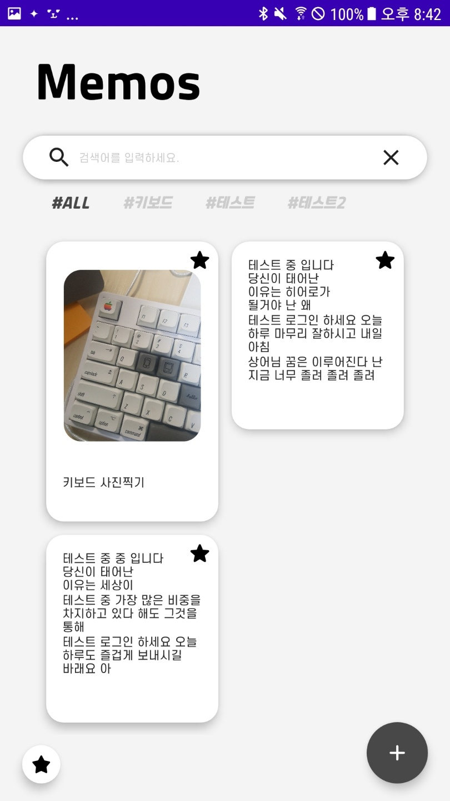

# ComposeMemo
Android Jetpack Compose로 만드는 간단한 메모앱

## 🔍  Overview

2021.11월 한달동안 진행한 [GDG 컴포즈 스터디](https://sites.google.com/view/devfest-korea-2021/compose-codelab)를 수료하고,
컴포즈에 익숙해지기 위해 만들어 본 메모 애플리케이션입니다. 아이폰의 메모 앱처럼 이미지, 텍스트, 체크박스 등 여러 요소를 자연스럽게 넣을 수 있도록 구현했습니다. 스터디에서 배운 컴포즈 스터디 내용을 적용하고자 컴포저블 테스트 라이브러리를 사용하여 컴포저블 메서드와 비즈니스 로직을 담당하는 부분을 테스트하는 단위 테스트를 번갈아 가며 테스트 주도 개발로 프로젝트를 진행했습니다. 프로젝트 진행 중에 배운 내용을 적용하고, 고민하면서 리팩터링을 통해 확장하기 쉬운 애플리케이션을 만들 수 있도록 노력했습니다.
 

  

## 🛠 사용기술 및 언어

`kotlin` `jetpack-compose` `room` `rxAndroid` `rxKotlin` `jetpack-navigation` `hilt` `compose-rx` `mockito` `truth` `junit5` `compose-viewModel`

## 🧐  스크린샷 및 주요 기능

  

**메인화면 - 전체 메모 리스트** 

  

**북마크 필터링**

- 왼쪽 하단의 별 아이콘을 클릭하면 북마크한 메모만 필터링 하여 보여줍니다.

  

**태그 필터링**

- 상단의 검색바 아래에 있는 태그를 클릭하면 해당 태그가 메모만 필터링하여 보여줍니다.
- 검색어, 태그, 북마크 모두 필터링 할 수 있습니다.

  

**검색어 필터링**

- 검색어를 포함한 메모만 필터링 하여 보여줍니다.

  

**메모 작성 화면**

- 태그를 추가할 수 있습니다.
- 텍스트 블록을 추가할 수 있습니다.
- 체크박스 블록을 추가할 수 있습니다.
- 이미지 블록을 추가할 수 있습니다.
- 뒤로가기 버튼을 클릭하면 컨텐츠 블록이 저장됩니다.
